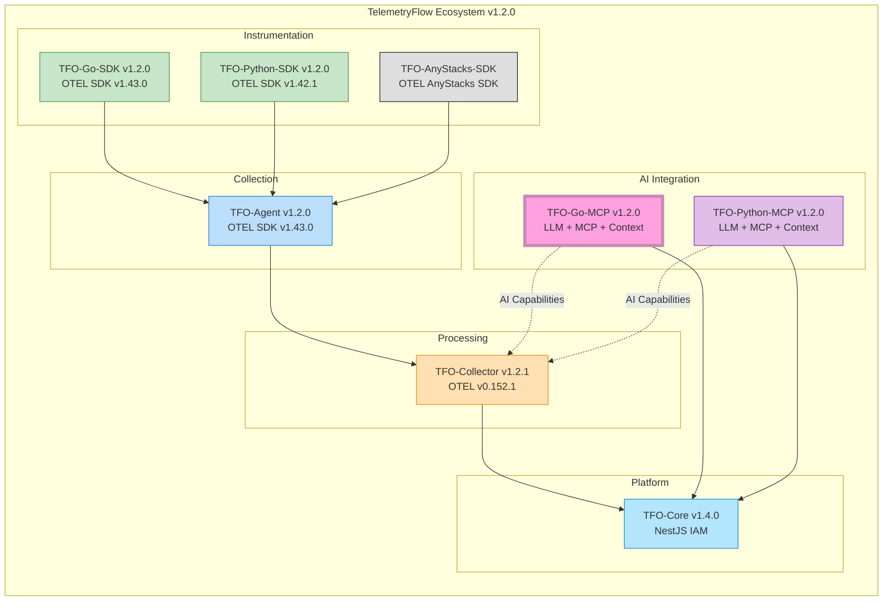
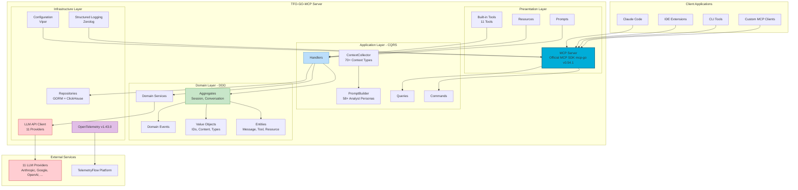
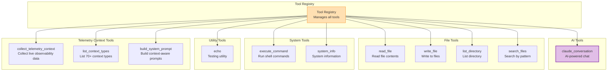

<div align="center">
  <picture>
    <source media="(prefers-color-scheme: dark)" srcset="https://github.com/telemetryflow/.github/raw/main/docs/assets/tfo-logo-mcp-dark.svg">
    <source media="(prefers-color-scheme: light)" srcset="https://github.com/telemetryflow/.github/raw/main/docs/assets/tfo-logo-mcp-light.svg">
    
  </picture>

  <h3>TelemetryFlow GO MCP Server (TFO-GO-MCP)</h3>

[](CHANGELOG.md)
[](https://opensource.org/licenses/Apache-2.0)
[](https://golang.org/)
[](https://modelcontextprotocol.io/)
[](https://anthropic.com)
[](https://opentelemetry.io/)
[](docs/ARCHITECTURE.md)
[](https://github.com/mark3labs/mcp-go)
[](https://www.postgresql.org/)
[](https://clickhouse.com/)

</div>

---

**Enterprise-Grade Model Context Protocol Server with Multi-Provider LLM Integration**

A comprehensive MCP server implementation built using Go and the official MCP Go SDK (`mcp-go v0.54.1`), following Domain-Driven Design (DDD) patterns, providing seamless integration between the Model Context Protocol and 11 LLM providers with 100+ models.

This server works as the **AI integration layer** for the TelemetryFlow Platform, providing:

- Multi-provider LLM conversation capabilities via MCP (11 providers, 100+ models)
- Tool execution with 11 built-in tools (8 builtin + 3 telemetry context)
- Resource management and prompt templates
- TelemetryFlow Go-SDK observability integration
- TFO-Platform ContextCollector and PromptBuilder integration

---

## TelemetryFlow Ecosystem



| Component          | Version    | OTEL Base          | Role                              |
| ------------------ | ---------- | ------------------ | --------------------------------- |
| TFO-Core           | v1.4.0     | -                  | Identity & Access Management      |
| TFO-Agent          | v1.2.0     | SDK v1.43.0        | Telemetry Collection Agent        |
| TFO-Collector      | v1.2.1     | Collector v0.152.1 | Central Telemetry Processing      |
| TFO-Go-SDK         | v1.2.0     | SDK v1.43.0        | Go Instrumentation                |
| TFO-Python-SDK     | v1.2.0     | SDK v1.42.1        | Python Instrumentation            |
| **TFO-Go-MCP**     | **v1.2.0** | **SDK v1.43.0**    | **Go MCP Server + LLM AI**        |
| TFO-Python-MCP     | v1.2.0     | TFO SDK v1.2.0     | Python MCP Server + LLM AI        |

---

## Quick Facts

| Property             | Value                                                   |
| -------------------- | ------------------------------------------------------- |
| **Version**          | 1.2.0                                                   |
| **Language**         | Go 1.26+                                                |
| **MCP Protocol**     | 2024-11-05                                              |
| **MCP SDK**          | mcp-go v0.54.1 (official)                               |
| **Claude SDK**       | anthropic-sdk-go v0.2.0-beta.3                          |
| **OTEL SDK**         | v1.43.0                                                 |
| **Architecture**     | DDD/CQRS                                                |
| **Transport**        | stdio, SSE (planned), WebSocket (planned)               |
| **Built-in Tools**   | 11 tools + ContextCollector + PromptBuilder              |
| **Context Types**    | 70+ context types across 7 categories                   |
| **Supported Models** | 100+ models across 11 LLM providers                    |
| **Test Coverage**    | 94% coverage, 18 test packages                          |
| **Concurrency**      | Goroutines with channels and mutexes                    |

---

## System Architecture



---

## Built-in Tools



### Tool Reference

| Tool                        | Category  | Description                            | Key Parameters                                                        |
| --------------------------- | --------- | -------------------------------------- | --------------------------------------------------------------------- |
| `claude_conversation`       | AI        | Send messages to Claude AI             | `message`, `model`, `system_prompt`                                   |
| `read_file`                 | File      | Read file contents                     | `path`, `encoding`                                                    |
| `write_file`                | File      | Write content to file                  | `path`, `content`, `create_dirs`                                      |
| `list_directory`            | File      | List directory contents                | `path`, `recursive`                                                   |
| `search_files`              | File      | Search files by pattern                | `path`, `pattern`                                                     |
| `execute_command`           | System    | Execute shell commands                 | `command`, `working_dir`, `timeout`                                   |
| `system_info`               | System    | Get system information                 | -                                                                     |
| `echo`                      | Utility   | Echo input (testing)                   | `message`                                                             |
| `collect_telemetry_context` | Telemetry | Collect live telemetry data from CH/PG | `organization_id`, `context_type`, `time_range_from`, `time_range_to` |
| `list_context_types`        | Telemetry | List all telemetry context types       | -                                                                     |
| `build_system_prompt`       | Telemetry | Build context-aware system prompt      | `context_type`, `custom_prompt`                                       |

---

## TFO-Platform Integration

### ContextCollector Service

Go port of TFO-Platform `ContextCollector.service.ts` — collects live telemetry context from ClickHouse materialized views and PostgreSQL for AI analysis.

**70+ Context Types across 7 categories:**

| Category | Context Types |
|----------|---------------|
| **Observability** | metrics, logs, traces, exemplars, correlations, dashboard |
| **Infrastructure** | uptime, status-page, audit, infra-overview, infra-cpu/memory/storage/network |
| **Kubernetes** | overview, clusters, namespaces, nodes, pods, deployments, pv, api-server, coredns |
| **Hybrid (PG+CH)** | agents, service-map, network-map |
| **Platform (PG)** | alerts, alert-rules, iam, iam-users/roles/permissions/matrix/assignments, tenancy, tenancy-regions/organizations/workspaces/tenants |
| **AI Intelligence** | anomaly-detection, corrective-maintenance, predictive-maintenance, cost-optimization |
| **DB Monitoring** | inventory, clickhouse, mariadb, mysql, percona, sqlite3, timescaledb, aurora, mssql, postgresql, mongodb-community/atlas, aws-rds-mysql/aurora, aws-dynamodb, cockroachdb, qan |

**ClickHouse Materialized Views queried:**
`metrics_5m` (AggMT), `logs_1h` (SumMT), `service_latency_percentiles_1h`, `service_error_rates_1h`, `exemplars_1h`, `uptime_checks`, `audit_logs_1h`, `signal_correlations_1h`, `vm_metrics_1h`, `kubernetes_metrics_1h`, `service_map_metrics_1h`, `network_map_traffic_1h`, `network_map_connection_metrics_1h`

### PromptBuilder Service

Go port of TFO-Platform `PromptBuilder.service.ts` — builds context-aware system prompts for LLM interactions.

- **58+ specialized analyst personas** — one per context type (e.g., metrics analyst, log analyst, trace analyst, Kubernetes admin, DB administrator, etc.)
- **5 insight types**: chronology, prediction, recommendation, root-cause, pattern
- Context-aware prompt generation with live data injection (10K char JSON truncation)

---

## Built-in Resources

| Resource          | Description            |
| ----------------- | ---------------------- |
| `config://server` | Server configuration   |
| `status://health` | Health status          |
| `file:///{path}`  | File access (template) |

---

## Built-in Prompts

| Prompt         | Description              |
| -------------- | ------------------------ |
| `code_review`  | Get thorough code review |
| `explain_code` | Get code explanation     |
| `debug_help`   | Get debugging assistance |

---

## Installation

### Prerequisites

- Go 1.26 or later
- Anthropic API key (or other supported LLM provider API key)

### From Source

```bash
# Clone the repository
git clone https://github.com/telemetryflow/telemetryflow-go-mcp.git
cd telemetryflow-go-mcp

# Download dependencies
make deps

# Build
make build

# Install to GOPATH/bin
make install
```

### Using Go Install

```bash
go install github.com/telemetryflow/telemetryflow-go-mcp/cmd/mcp@latest
```

### Docker

```bash
# Build image
docker build -t telemetryflow-go-mcp:1.2.0 .

# Run container
docker run --rm -it \
  -e ANTHROPIC_API_KEY="your-api-key" \
  telemetryflow-go-mcp:1.2.0
```

---

## Configuration

### Configuration File

Create `tfo-mcp.yaml` or use `configs/tfo-mcp.yaml`:

```yaml
# =============================================================================
# TelemetryFlow GO MCP Server Configuration
# Version: 1.2.0
# =============================================================================

server:
  name: "TelemetryFlow-MCP"
  version: "1.2.0"
  transport: "stdio" # stdio, sse, websocket
  debug: false

claude:
  # api_key: Set via ANTHROPIC_API_KEY env var
  default_model: "claude-opus-4-7"
  max_tokens: 4096
  temperature: 1.0
  timeout: "120s"
  max_retries: 3

mcp:
  protocol_version: "2024-11-05"
  enable_tools: true
  enable_resources: true
  enable_prompts: true
  enable_logging: true
  tool_timeout: "30s"

logging:
  level: "info" # debug, info, warn, error
  format: "json" # json, text
  output: "stderr"

telemetry:
  enabled: true
  # api_key: Set via TELEMETRYFLOW_API_KEY env var
  service_name: "telemetryflow-go-mcp"
  environment: "production"
  otlp_endpoint: "localhost:4317"
```

### Environment Variables

| Variable                                 | Description               | Default                    |
| ---------------------------------------- | ------------------------- | -------------------------- |
| `ANTHROPIC_API_KEY`                      | Claude API key (required) | -                          |
| `TELEMETRYFLOW_MCP_SERVER_TRANSPORT`     | Transport type            | `stdio`                    |
| `TELEMETRYFLOW_MCP_SERVER_PORT`          | Server port (SSE/WS)      | `8080`                     |
| `TELEMETRYFLOW_MCP_LOG_LEVEL`            | Log level                 | `info`                     |
| `TELEMETRYFLOW_MCP_LOG_FORMAT`           | Log format                | `json`                     |
| `TELEMETRYFLOW_MCP_DEBUG`                | Debug mode                | `false`                    |
| `TELEMETRYFLOW_MCP_CLAUDE_DEFAULT_MODEL` | Default Claude model      | `claude-opus-4-7`          |
| `TELEMETRYFLOW_MCP_OTLP_ENDPOINT`        | OTEL collector endpoint   | `localhost:4317`           |
| `TELEMETRYFLOW_MCP_POSTGRES_URL`         | PostgreSQL connection URL | -                          |
| `TELEMETRYFLOW_MCP_CLICKHOUSE_URL`       | ClickHouse connection URL | -                          |

---

## Usage

### Running the Server

```bash
# Run with default config
tfo-mcp

# Run with custom config
tfo-mcp --config /path/to/config.yaml

# Run in debug mode
tfo-mcp --debug

# Show version
tfo-mcp version

# Validate configuration
tfo-mcp validate
```

### Integration with Claude Desktop

Add to your Claude Desktop configuration (`claude_desktop_config.json`):

```json
{
  "mcpServers": {
    "telemetryflow": {
      "command": "tfo-mcp",
      "args": [],
      "env": {
        "ANTHROPIC_API_KEY": "your-api-key"
      }
    }
  }
}
```

---

## TelemetryFlow SDK Integration

The MCP server integrates with the TelemetryFlow Go-SDK (`v1.2.0`) to provide comprehensive observability:

### Enable Telemetry

```bash
# Configure via environment variables
export TELEMETRYFLOW_ENABLED=true
export TELEMETRYFLOW_API_KEY=your-telemetryflow-api-key
export TELEMETRYFLOW_ENDPOINT=localhost:4317
```

### TFO-Platform Integration

The MCP server integrates with TFO-Platform components for context-aware AI analysis via Go port services:

- **ContextCollector** — Go port of `ContextCollector.service.ts`. Collects live telemetry context from ClickHouse materialized views and PostgreSQL, providing rich operational data for AI analysis across 70+ context types in 7 categories
- **PromptBuilder** — Go port of `PromptBuilder.service.ts`. Builds context-aware system prompts per context type, leveraging 58+ specialized analyst personas and 5 insight types for targeted telemetry analysis

### Collected Telemetry

| Signal  | Metric/Span           | Description                   |
| ------- | --------------------- | ----------------------------- |
| Metrics | `mcp.tools.calls`     | Tool call count by tool name  |
| Metrics | `mcp.tools.duration`  | Tool execution duration       |
| Metrics | `mcp.tools.errors`    | Tool error count              |
| Metrics | `mcp.resources.reads` | Resource read count           |
| Metrics | `mcp.prompts.gets`    | Prompt get count              |
| Metrics | `mcp.sessions.events` | Session lifecycle events      |
| Traces  | `mcp.tools.execute.*` | Tool execution spans          |
| Logs    | Various               | Structured logs for debugging |

---

## Project Structure

```
telemetryflow-go-mcp/
├── cmd/
│   └── mcp/
│       └── main.go                     # Application entry point
├── internal/
│   ├── domain/                         # Domain Layer (DDD)
│   │   ├── aggregates/                 # Session, Conversation aggregates
│   │   ├── entities/                   # Message, Tool, Resource, Prompt
│   │   ├── valueobjects/               # Immutable value objects
│   │   ├── events/                     # Domain events
│   │   ├── repositories/               # Repository interfaces
│   │   └── services/                   # Domain service interfaces
│   ├── application/                    # Application Layer (CQRS)
│   │   ├── commands/                   # Write operations
│   │   ├── queries/                    # Read operations
│   │   ├── handlers/                   # Command/Query handlers
│   │   └── services/                   # Application services (ContextCollector, PromptBuilder)
│   ├── infrastructure/                 # Infrastructure Layer
│   │   ├── claude/                     # LLM API client (11 providers)
│   │   ├── config/                     # Viper configuration
│   │   ├── cache/                      # Redis cache implementation
│   │   ├── logging/                    # Structured logging (Zerolog)
│   │   ├── queue/                      # NATS JetStream queue
│   │   └── persistence/                # Repository implementations (GORM + ClickHouse)
│   └── presentation/                   # Presentation Layer
│       ├── server/                     # MCP server implementation (mcp-go v0.54.1)
│       ├── tools/                      # Built-in tools (11 total)
│       ├── resources/                  # Built-in resources
│       └── prompts/                    # Built-in prompts
├── migrations/                         # Database migrations
├── scripts/                            # Initialization scripts
├── tests/                              # Test suites (18 packages, 94% coverage)
│   ├── unit/                           # Unit tests
│   ├── integration/                    # Integration tests
│   └── e2e/                            # End-to-end tests
├── configs/                            # Configuration files
├── docs/                               # Documentation
├── .kiro/                              # Specifications and steering
├── Makefile                            # Build automation
├── Dockerfile                          # Container build
├── docker-compose.yaml                 # Development stack
├── go.mod                              # Go module
└── .env.example                        # Environment template
```

---

## Development

### Make Commands

```bash
# Development
make build              # Build binary
make build-release      # Build optimized release binary
make run                # Build and run
make run-debug          # Run in debug mode
make install            # Install to GOPATH/bin
make clean              # Clean build artifacts

# Dependencies
make deps               # Download dependencies
make deps-update        # Update and tidy dependencies
make deps-refresh       # Refresh all dependencies (clean + download)
make deps-vendor        # Vendor dependencies
make deps-check         # Check for vulnerabilities (requires govulncheck)

# Code Quality
make fmt                # Format code
make vet                # Run go vet
make lint               # Run golangci-lint
make lint-fix           # Auto-fix lint issues
make staticcheck        # Run staticcheck

# Testing
make test               # Run tests
make test-cover         # Tests with coverage
make test-bench         # Run benchmarks
make test-short         # Run short tests only
make test-all           # Run all tests (unit, integration, e2e)

# Cross-compilation
make build-all          # Build for all platforms
make build-linux        # Build for Linux
make build-darwin       # Build for macOS
make build-windows      # Build for Windows

# Docker
make docker-build       # Build Docker image
make docker-run         # Run Docker container

# CI/CD
make ci                 # Full CI pipeline
make ci-test            # CI pipeline (format, vet, lint, test)
make release            # Create release artifacts
```

### Testing

```bash
# Run all tests
make test

# Run all test types (unit, integration, e2e)
make test-all

# Run with coverage
make test-cover

# Run CI test pipeline (format + vet + lint + test)
make ci-test

# Run benchmarks
make test-bench
```

---

## MCP Capabilities Matrix

> Capabilities are handled internally by the official MCP Go SDK (`mcp-go v0.54.1`).

| Capability              | Status | Description                         |
| ----------------------- | ------ | ----------------------------------- |
| `tools`                 | ✅     | Tool listing and execution          |
| `tools.listChanged`     | ✅     | Dynamic tool registration           |
| `resources`             | ✅     | Resource listing and reading        |
| `resources.subscribe`   | ✅     | Resource change subscriptions       |
| `resources.listChanged` | ✅     | Dynamic resource registration       |
| `prompts`               | ✅     | Prompt templates                    |
| `prompts.listChanged`   | ✅     | Dynamic prompt registration         |
| `logging`               | ✅     | Log level management                |
| `sampling`              | 🔜     | LLM sampling (planned)              |

---

## LLM AI Integration

### Supported Providers (11 Providers, 100+ Models)

| Provider  | Example Models                                | API Key Env Variable        |
| --------- | --------------------------------------------- | --------------------------- |
| Anthropic | Claude 4 Opus, Claude 4 Sonnet, Claude 3.5    | `ANTHROPIC_API_KEY`         |
| Google    | Gemini 3.5 Flash, Gemini 2.5 Pro/Flash        | `GOOGLE_API_KEY`            |
| OpenAI    | GPT-5.5 Pro, GPT-5.4, o3                      | `OPENAI_API_KEY`            |
| DeepSeek  | DeepSeek V4 Pro, DeepSeek R1/R2 Reasoner      | `DEEPSEEK_API_KEY`          |
| Qwen      | Qwen 3.6 Max/Plus/Flash                       | `QWEN_API_KEY`              |
| Mistral   | Mistral Medium 3.5, Mistral Large 3, Codestral| `MISTRAL_API_KEY`           |
| Grok      | Grok 4.3, Grok 4.20 Multi-Agent/Reasoning     | `XAI_API_KEY`               |
| Kimi      | K2.6, K2.5, Moonshot V1                       | `MOONSHOT_API_KEY`          |
| Zhipu     | GLM 5.1, GLM 5 Turbo, GLM 4.7                | `ZHIPU_API_KEY`             |
| MiMo      | MiMo V2.5 Pro, MiMo V2 Pro                    | `MIMO_API_KEY`              |
| Ollama    | llama3, mistral, codellama (local)            | `OLLAMA_HOST`               |

### Default Model

The default model is `claude-opus-4-7` (Anthropic Claude 4 Opus), configurable via the `claude.default_model` setting or `TELEMETRYFLOW_MCP_CLAUDE_DEFAULT_MODEL` environment variable.

---

## Security Considerations

| Aspect                | Implementation                           |
| --------------------- | ---------------------------------------- |
| **API Key Storage**   | Environment variables only               |
| **Command Execution** | Configurable timeout, sandboxing planned |
| **File Access**       | Path validation, no traversal            |
| **Rate Limiting**     | Configurable per-minute limits           |
| **CORS**              | Configurable for SSE transport           |
| **Input Validation**  | JSON Schema validation for tools         |

---

## Documentation Index

| Document                                           | Description                         |
| -------------------------------------------------- | ----------------------------------- |
| [README.md](README.md)                             | Project overview and quick start    |
| [docs/ARCHITECTURE.md](docs/ARCHITECTURE.md)       | Detailed architecture documentation |
| [docs/CONFIGURATION.md](docs/CONFIGURATION.md)     | Configuration reference             |
| [docs/COMMANDS.md](docs/COMMANDS.md)               | CLI commands reference              |
| [docs/DEVELOPMENT.md](docs/DEVELOPMENT.md)         | Development guide                   |
| [docs/INSTALLATION.md](docs/INSTALLATION.md)       | Installation guide                  |
| [docs/TROUBLESHOOTING.md](docs/TROUBLESHOOTING.md) | Troubleshooting guide               |
| [CONTRIBUTING.md](CONTRIBUTING.md)                 | Contribution guidelines             |
| [SECURITY.md](SECURITY.md)                         | Security policy                     |
| [CHANGELOG.md](CHANGELOG.md)                       | Version history                     |

---

## Contributing

1. Fork the repository
2. Create a feature branch (`git checkout -b feature/amazing-feature`)
3. Commit your changes (`git commit -m 'Add amazing feature'`)
4. Push to the branch (`git push origin feature/amazing-feature`)
5. Open a Pull Request

### Development Guidelines

- Follow Go best practices and idioms
- Use DDD patterns for domain logic
- Write unit tests for all handlers
- Document public APIs
- Keep commits atomic and well-described

---

## License

This project is licensed under the Apache License 2.0 - see the [LICENSE](LICENSE) file for details.

---

## Related Projects

- [TelemetryFlow Python MCP](https://github.com/telemetryflow/telemetryflow-python-mcp) - Python implementation
- [TelemetryFlow Go SDK](https://github.com/telemetryflow/telemetryflow-go-sdk) - Go observability SDK
- [TelemetryFlow Python SDK](https://github.com/telemetryflow/telemetryflow-python-sdk) - Python observability SDK
- [TelemetryFlow Platform](https://github.com/telemetryflow/telemetryflow) - Main platform

---

## Support

- **Documentation**: [TelemetryFlow Docs](https://docs.telemetryflow.id)
- **Issues**: [GitHub Issues](https://github.com/telemetryflow/telemetryflow-go-mcp/issues)
- **Discussions**: [GitHub Discussions](https://github.com/telemetryflow/telemetryflow-go-mcp/discussions)

---

<p align="center">
  <strong>Built with Go and multi-provider LLM integration for the TelemetryFlow Platform</strong>
  <br/>
  <sub>Copyright &copy; 2024-2026 Telemetri Data Indonesia. All rights reserved.</sub>
</p>
