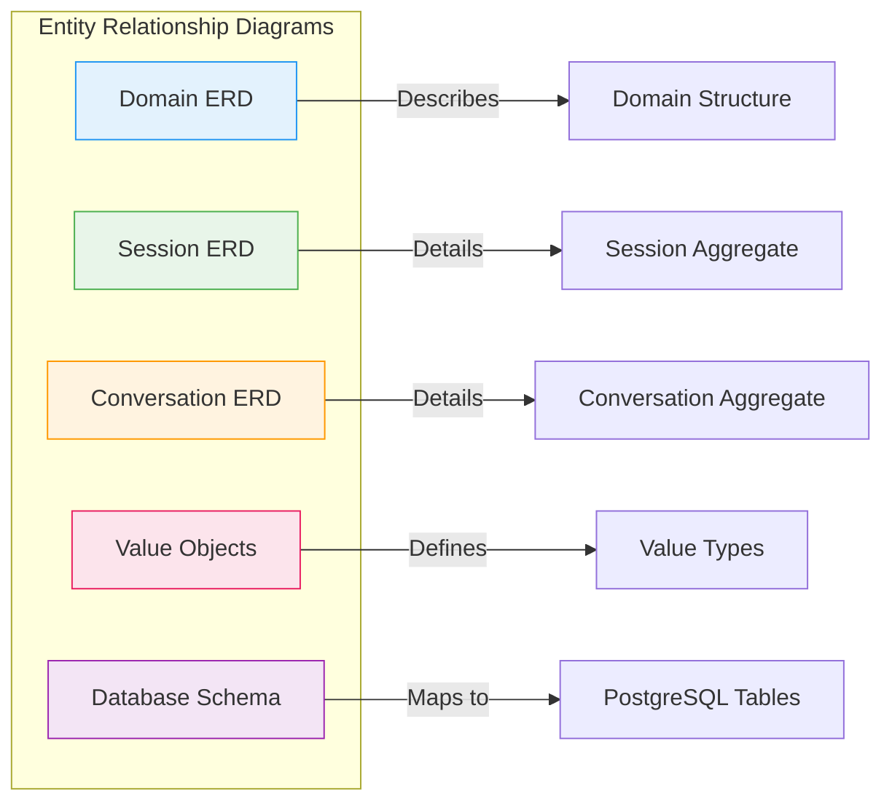
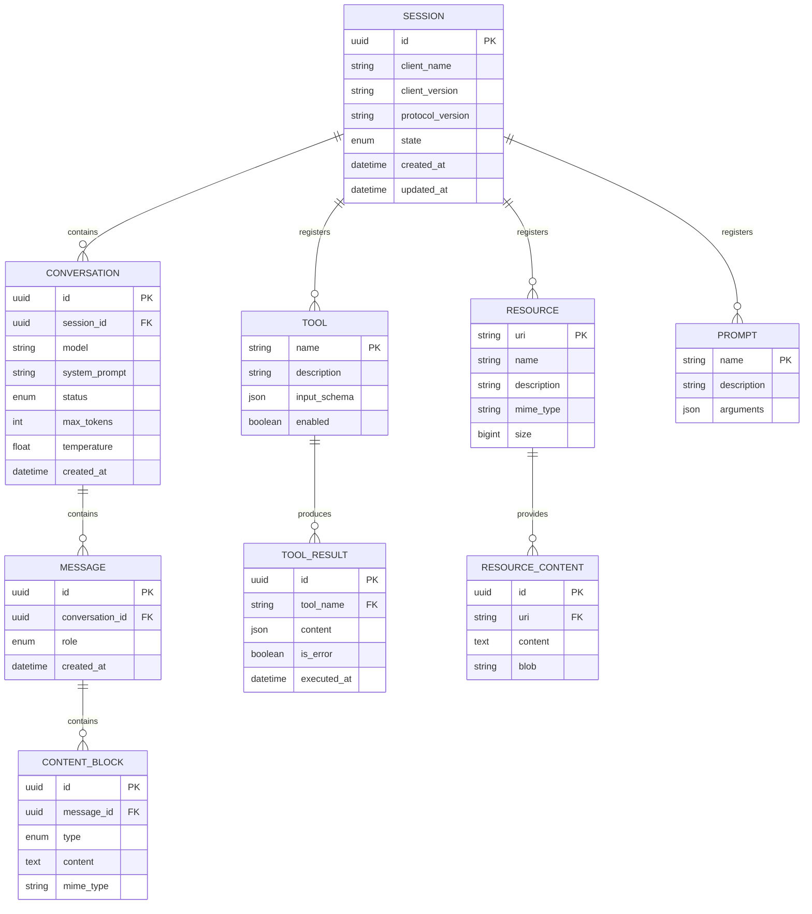
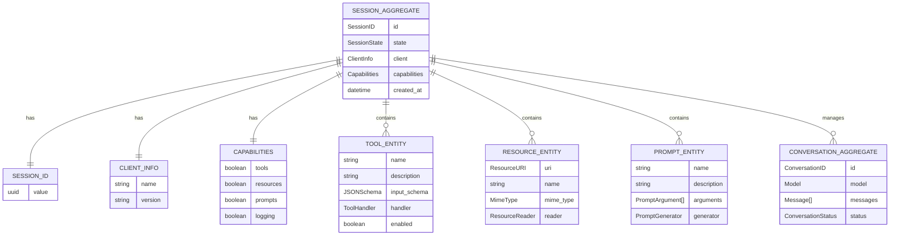
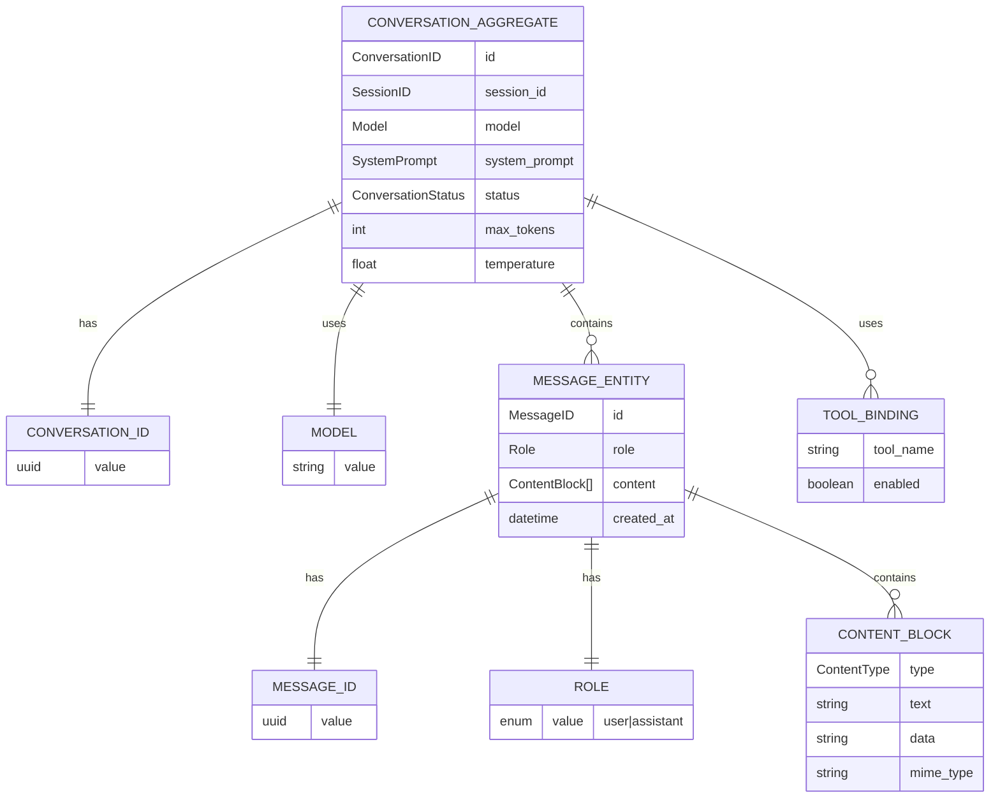
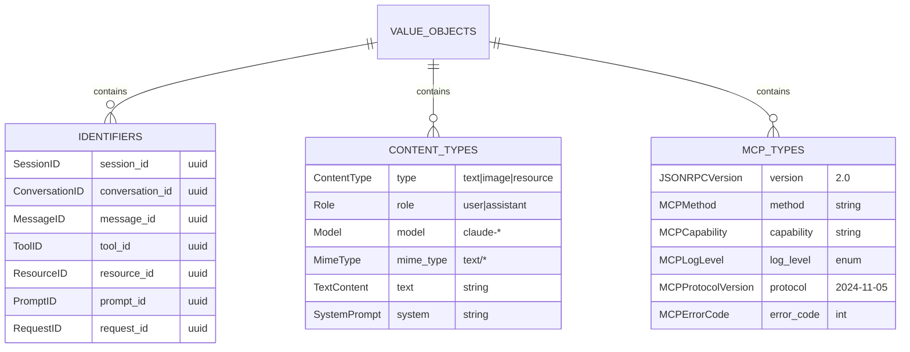
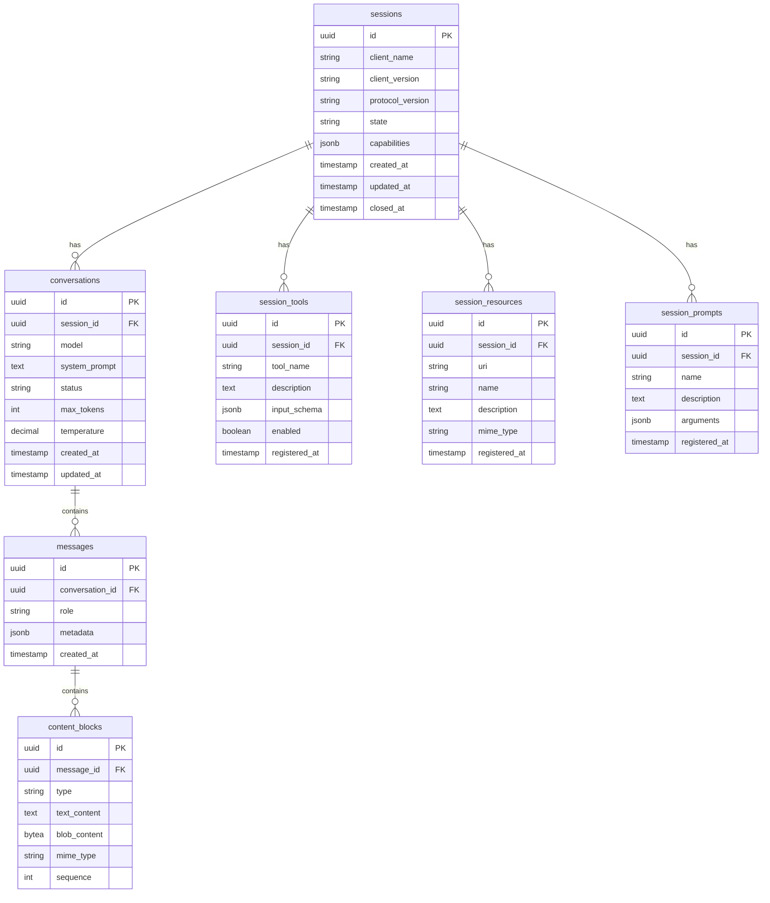
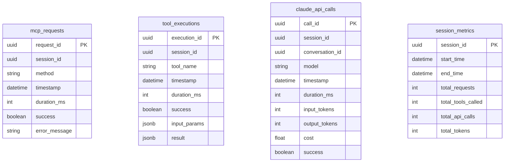

# TFO-MCP Entity Relationship Diagrams

> Entity Relationship Diagrams for TelemetryFlow MCP Server

---

## Table of Contents

- [Overview](#overview)
- [Complete Domain ERD](#complete-domain-erd)
- [Session Aggregate ERD](#session-aggregate-erd)
- [Conversation Aggregate ERD](#conversation-aggregate-erd)
- [Value Objects ERD](#value-objects-erd)
- [Database Schema](#database-schema)

---

## Overview

This document provides Entity Relationship Diagrams that describe the data structures and relationships within the TFO-MCP Server.

---

## Complete Domain ERD

---

## Session Aggregate ERD

---

## Conversation Aggregate ERD

---

## Value Objects ERD

---

## Database Schema

### PostgreSQL Schema

### ClickHouse Analytics Schema

---

## Related Documentation

- [Data Flow Diagrams](DFD.md)
- [Architecture Guide](ARCHITECTURE.md)
- [Development Guide](DEVELOPMENT.md)

---

**[Back to Documentation Index](README.md)**

